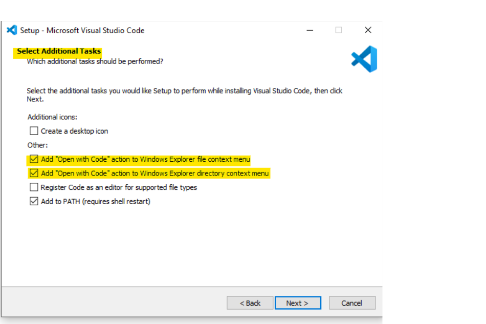

# Setup the development environment for Windows

## First step: Downloading the applications

+ [.NET 5 SDK](https://dotnet.microsoft.com/download/dotnet/5.0)
+ [Git](https://git-scm.com/downloads)
+ [Visual Studio Code](https://code.visualstudio.com/download)

### Installing .NET SDK

The [.NET 5 SDK](https://dotnet.microsoft.com/download/dotnet/5.0) is about running and building the application. Once the source code is written in the editor, .NET SDK does its magic to build our application, to run the application, provide us with a debugger, and so much more. Installing is very simple. Downloading and following the instructions. In most cases, the x64 should be the right version.

The installer is pretty simple. After opening the setup file, you need to click »Install«.


After that, the UAC kicks in and asks if you know what you are doing. We might not always know what we are doing, but we can be confident in this particular case.


And after that, .NET 5. SDK is ready to use.


 You can open a terminal and type

```
dotnet --version
```

and should see an output like this one.


If the versions are not the same, don't worry. You might are more up-to-date than this instruction.


## Installing Git

Git helps us to manage the source code. In the beginning, you can think about it as a specialized version of OneDrive/Google Drive, etc., for source code. We'll use it to get the needed files for the episodes. 

After the download of [Git](https://git-scm.com/downloads), the installer asks many questions, and there are plenty of possibilities to change the way Git behaves. For us, as beginners, we can stick we the defaults. There is only one option that  I recommend to change: default branch name.


And at the end, maybe you don't want to see the release notes. 

After the installer has finished its magic, you can open a terminal type

```
git --version
```
to see if everything works as expected.


## Installing Visual Studio Code

That is the last part - installing Visual Studio Code. We will use this editor, called IDE (integrated development environment), to write source code more efficiently. 

It has not only a great interface, thousands of plugins and customization options, but more importantly, it has a debugger, we can use to find the errors and seeing what really happens. 

I recommend choosing  [Download Visual Studio Code](https://code.visualstudio.com/download) 
.

The setup, as with git, opens with a UAC dialogue.


 After going through the necessary steps of the wizard, it asks for additional tasks. I recommend choosing the first two options because it gives a convenient opportunity to start Visual Studio Code.

 

When the installer is finished, vs code is started for us. Now, we need to install one plugin and are ready.

On the left side, choose the Extensions panel. You can find it at the bottom of the symbols and the left. Enter »C#« as a search term, and choose the extension called »C#«. Than, you can install the application.


Everything is ready to code. Happy coding :smile:


