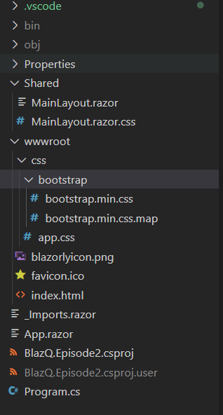

# Episode 02 - Building the shell

> Thanks for being with me in the second episode. I had a lot of fun and loved your engagement. 

Watch the teaser on [Youtube](https://youtu.be/EhEwoFpNqnE). 

## Content

The second episode is not an introduction anymore. We start exploring what the realm of Blazor and C# has to offer for us. 

After we were using ```dotnet new``` to create a new Blazor application, we eliminate the things we don't need.

We talk about what moving parts belong to a Blazor application and where we need to make changes to have the desired result.

After this short intro, we get our minds into coding and develop the first version of the quiz. 
 
## Get started 

There are two ways to get started, but before you need to have set up your development machine. You can find [here](https://github.com/just-the-benno/BlazQ/tree/main/episode1) instructions per system (setup-windows.md etc).

### Cloning the repo 

The recommended way is cloning the repository. 

```
git clone https://github.com/just-the-benno/BlazQ.git
```

and navigate to the directory ```episode2/BlazQ.Episode2/BlazQ.Episode2```. Open this directory with VS code, and you are prepared. 

### dotnet new and a cleaning up 

The other approach is to start with the blazor web assembly template and clean it up.

```
dotnet new blazorwasm -n BlazQ.Episode02
```

The folder structure should look like



You should remove the entire Pages folder as well as all files not shown in the screenshot above. 

Add the end of the file ```app.css``` in the *wwwroot/css* folder append the following lines to use the BlazQ style in case you want to have the same style as in the teaser.

```css
/* Custom BlazQ styles */

.form-check-input:disabled~.form-check-label {
    color: #999999;
}

.option-selected {
    background-color: white;
    color           : black;
}

.correct-option {
    background-color: #82d282;
    color           : white;
}

.background-turquois {
    background-color: #00C5B1;
}

.background-dark-purple {
    background-color: #421c78;
}

.background-dark-purple {
    background-color: #421c78;
}

.border-dark-purple {
    border-color: #421c78;
}

.background-light-purple {
    background-color: #8071b2;
}

.border-dark-purple {
    border-color: #8071b2;
}
``` 

Change the style of the ```.top-row``` class in the ```MainLayout.razor.css``` 

```css
.top-row {
    background-color: #00C5B1;
    border-bottom   : 1px solid #d6d5d5;
    justify-content : flex-end;
    height          : 3.5rem;
    display         : flex;
    align-items     : center;
    color           : white;
}

.top-row a {
    color: white;
}
```

Open the ```MainLayout.razor``` and replace the content with this one.

```html
@inherits LayoutComponentBase

<div class="page">
    <div class="main">
        <div class="top-row px-4">
            <a href="/">BlazQ</a>
        </div>

        <div class="content px-4">
            @Body
        </div>
    </div>
</div>

```

You are ready to go.

## Learning outcome

We should feel proud because we have made a brilliant first game. Of course, there are plenty of things to improve, but that doesn't matter, because we have something we can play with family and friends. It is easy to make it your game. Add your questions and avatars and see the joy you can create. 

## Feedback form

BlazQ is feedback-driven. The feedback provided by you helps me to improve the learning experience for everyone. I highly encourage you to take the time to fill out the form. The results and what changed based on them will be discussed in the next session.

[Feedback form](https://forms.gle/7fTNmCXLbyUoPt9Z7 ) 

If you didn't enjoy the experience, think about the why and feel free to send me your feedback directly or fill out the feedback form. 

## Media

+ [Slides](media/slides-episode-02.pdf)
+ [Recorded session on YouTube](https://youtu.be/ioQhauIIyp0)
